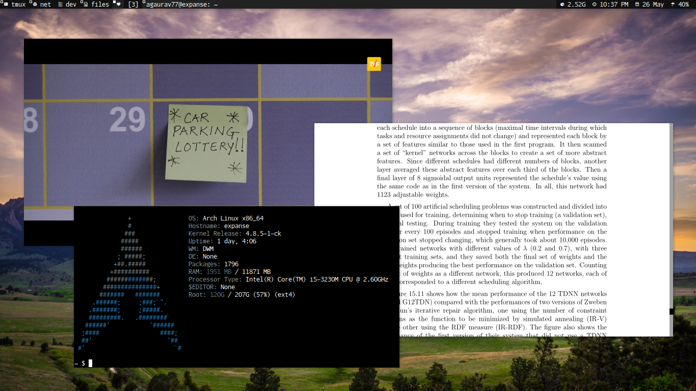

dwm - dynamic window manager
============================
dwm is an extremely fast, small, and dynamic window manager for X. This
repo has my tweaks on dwm.

* [dwm website](http://dwm.suckless.org/)
* [patches](http://dwm.suckless.org/patches/)



Build
-----
In order to build dwm you need the Xlib header files. Assuming everything
goes into places as specified in config.mk,

    ```bash
    $ sudo make && sudo make install && make clean
    ```

xinitrc
-------
I use dwm from startx. The general idea is this:

    
    ```bash
    while true; do

      # set wallpaper
      feh --bg-fill /path/to/bg_picture &>/dev/null

      if [[ -z $(ps -A | grep start-barM) ]]; then
        start-barM &
      fi

      # start dwm with log (as mentioned in ArchWiki)
      dwm 2> ~/.dwm.log
    done &

    # start compton as the last thing
    if [[ -z $(ps -A | grep compton) ]]; then
        exec compton -fG
    fi
    ```

Added Patches
-------------

* System Tray
* Randomised launch in floating mode (self patch)
* barM code from website
* Status Bar Colors
